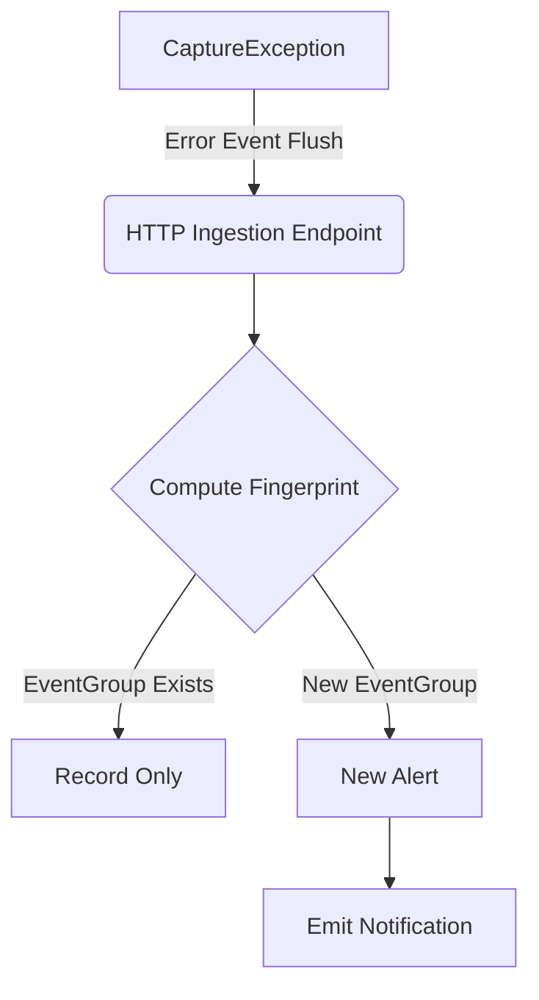

# Periscope

**Periscope** is a **self-contained error aggregator** that uses in-memory pub/sub for asynchronous
event ingestion. The only required dependency is a relational database.
Postgres is the preferred database backend, however SQLite can work for small workloads or
for non-production environments.

---

## Getting Started

### Environment Variables

| Name                   | Description                                                                                          | Default     | 
|------------------------|------------------------------------------------------------------------------------------------------|-------------|
| `API_SECRET_KEY_ADMIN` | The API key used for accessing administration endpoints, e.g. creating new projects, listing alerts. |             |
| `POSTGRES_HOST`        | Postgres server hostname or IP.                                                                      | `localhost` |
| `POSTGRES_PORT`        | Postgres server port.                                                                                | `5432`      |
| `POSTGRES_USER`        | Postgres username.                                                                                   | `pguser`    |
| `POSTGRES_PASSWORD`    | Password for the Postgres user.                                                                      |             |
| `POSTGRES_DATABASE`    | Name of the Postgres database.                                                                       | `periscope` |
| `POSTGRES_ENABLED`     | When `true` the Postgres database configuration is used.                                             | `false`     |

## How It Works

Periscope accepts events in compliance with the [Sentry data model](https://develop.sentry.dev/sdk/data-model/event-payloads/).
You can use any official Sentry SDK to send events. An example using the [Go SDK](https://github.com/getsentry/sentry-go) can be found 
in the [integration tests](tests/integration/event_group_custom_fingerprint_test.go).

> :warning: [Sentry](https://sentry.io/) is an incredible platform for error monitoring! Periscope only aims to provide a very simplistic version of error aggregation functionality, using a simple architecture that should be easily deployed and operated.

- Incoming events are validated and routed to projects.
- Each new event is assigned to an event group, based on the extracted fingerprint, in an in-memory background process.
- Each new event group generates an alert and each alert generates notifications for the preconfigured alert destination channels.
